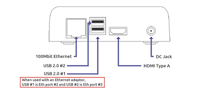
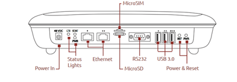

# Physical Ports

This screen shows information about the Ethernet ports on the VeeaHub network.

A port can be configured as a WAN or LAN port:
- WAN: this port is used as the wired connection (backhaul) to the Internet. This is available on the gateway VeeaHub (MEN) only.
- LAN: this port is in use to connect a device to the VeeaHub network with an Ethernet cable. This can be applicable on any node in the network, where a port is available. Several devices can be connected to this port if you use a switch

A port can also be used to create a wired connection to another VeeaHub and thus to the mesh network. This might be used, for example, to bridge the gap with a cable between two nodes where the distance is too great for effective Wi-Fi communication. A VeeaHub mesh can consist of any mixture of wired and wireless links. The mesh configures itself to provide full connectivity and redundancy. When a port is in use as a mesh port, this is displayed by the Mesh switch on this tab against that port.

if all the VeeaHubs in the network are wired, the wireless mesh can be switched off (section 4.6.1), although that is not necessary.

There are certain cases in the current software version where some manual configuration may be needed. For more information about automatic configuration for wired mesh, please see veea.com/support

## Key Concepts

### Role      
Select the usage of this physical port.
WAN: As is but remove the wan settings are described in the Documentation.
LAN: This configures the port to be used as a LAN connection for other devices.

### Mesh
If enabled, a wired mesh is formed with peer hubs on the same LAN segment. Hubs can form a peer mesh on the LAN network of an MEN or MN. They can also form a mesh on the WAN network with a routed or bridged MEN. You can disable wired mesh if not required, for example if only the MEN is connected to a WAN network, or a LAN port is on an isolated segment with no peer hubs connected.

### Status
This indicates the operational state of the port.

**Grey circle** (don’t include a description of the icon in the text)
The port has never been connected and is not in use

**Orange circle with bar**
The port has been disabled

**Red circle with cross**
The port is not operational, please refer to ‘Reason’ for more information

**Green circle with tick**
The port is operational

**Triangle with Exclamation Mark**
The configuration for the port is not complete

**Document with up arrow**
The change has not yet been applied

**Blue circle**
Used to be used for ‘not in use’ but we no longer see this! Happy days…

Similarly for LAN and APs, just replace ‘port’ in the text

### Reason
Port never connected
Port disconnected

Device never presents
Device removed

DHCP conflict

### Link
Indicates if the port is active, so cabled and connected to a networking or client device.

**Green dot**
The port is active and connected to a peer networking or client device

**Grey dot**
The port is not active, either a cable is not inserted, or no link activity is detected with a peer device.

### Enabled
_Remove_: on this node, although the default settings apply across the rest of the network
_Add_: If HUB is selected, then the port is disabled on this node. If NET is selected, the port is disabled across the network, but may be overridden locally on a hub.

### Hub / Net
_Remove_: If the hub Use field is on, then this local configuration takes precedence over any network settings.

_Add_: When the changes are applied, the position of the slider determines which configuration to use. Note that if you are changing network settings for a port at the MEN, but are using the HUB settings locally, then the changes must be made to the network settings and then the slider

### Reset port button
Reset any fault conditions on the port. A disconnected port is no longer considered a fault condition. Any DHCP conflict is cleared and re-tested.

## VHC05 Physical ports

On the VHC05, there is only one Ethernet port. In the typical case of Ethernet backhaul, the Ethernet port on the MEN is already dedicated to the WAN. You can use the USB ports as Ethernet ports with suitable adaptors. In these cases, Port 2 is the lower USB socket, and Port 3 is the upper USB socket.

## VHE09/VHE10 Physical ports

On the VHE09/10, there are two Ethernet ports. They are marked on the casing with one dot for Port 1 and two dots for Port 2. Either port can be used as the WAN port, and the other can be configured as LAN. By default, Port 2 on the gateway VeeaHub is configured for WAN. If you change the cable to the other port, you must restart the VeeaHub. Port 1 can be used for Power over Ethernet, as an alternative to the regular power supply. Note that on the gateway VeeaHub it is not possible to configure both Ethernet ports as LAN ports.

There are also two USB ports that can be used as Ethernet ports with adaptors. They are Port 3 (one dot) and Port 4 (two dots). The USB port with three dots cannot be used as a LAN port.

## Example configurations

An example of the use of the Port number and Enabled/Disabled controls is:
- On the gateway VeeaHub, you select a Port number, select **NETWORK**, then select **Enabled**. The configuration of that port (WAN, LAN or Mesh) is then copied to all the nodes in the mesh.
- On another node, you select the same Port Number and then set to **Disabled**. This turns off the function on that port on that VeeaHub. This might be used, for example, where you wish to disable the LAN port on a node in a public area so that it is not possible to plug in an unauthorized device.
- Alternatively, on the other node, you can select **HUB**, then configure the port for a specific use on that VeeaHub alone.

The following configurations are offered for each port...

**Status Bar**
At the right of the port number and name, the current status of this port is displayed with a symbol, for example, Active, Non-operational, Disabled, Used by Hub, Changes not applied.

Below the port number, information or error messages are displayed.

**Hub / Network selector**
On the gateway VeeaHub (MEN), set this to Network to apply the settings to port on all nodes across the VeeaHub network.

On any VeeaHub, set this to Hub to apply the settings to the port on this node alone. This overrides any mesh-wide settings for this port.

**Enable**
Enables an override of the default usage of this port.

**Mesh**
If on, this port is configured for wired mesh connection (see above)

**Role**
This selects this physical port for WAN or LAN use.

**WAN**: This can only be set on a gateway VeeaHub and indicates which port is used for backhaul connectivity. There must be only one WAN port on a mesh.
**LAN**: This specifies that the port is a LAN connection for other devices.

**Edit Port Name**
Enables you to change the name of this port. 

---

**Note**. If an Ethernet cable is connected to another network with a DHCP server and is plugged into a LAN port, this is an error situation. VHM will display the message ‘DHCP conflict’. See section 7.3.

**Note**. When an Ethernet port is In Use and Enabled but has no connected device, VHM will display the message ‘Port Down’.

Note. If a USB port has been configured as a LAN port but no Ethernet adaptor is present, the message ‘Not Fitted’ is displayed.

**Note**. These messages are displayed if the error condition applies when you connect VHM to the VeeaHub, or if you tap APPLY while on the Physical Port screen.
